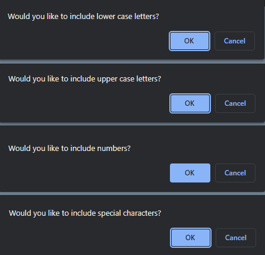
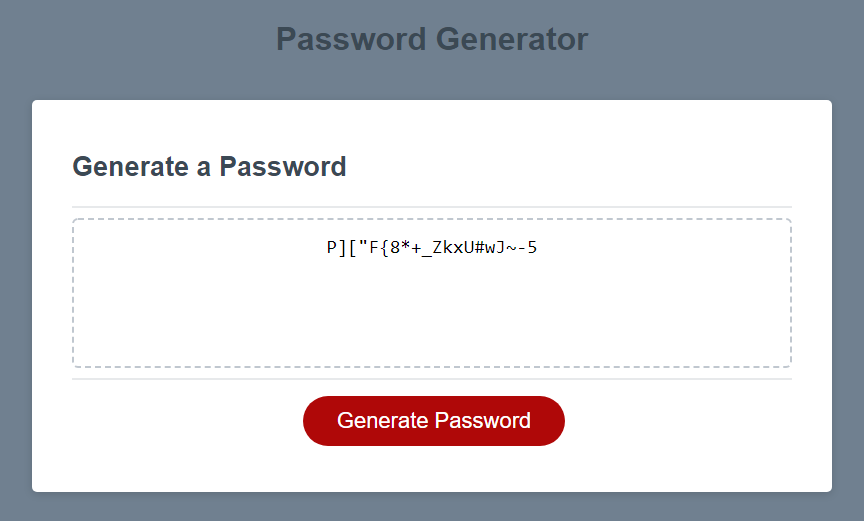

<h1><a href="https://jamehzlee.github.io/Password-Generator/" target="_blank">Password Generator</a></h1>

## After the user clicks the "Generate Password" button, the user is asked what kinds of characters to include and to choose a number between 8-128 for the password length.

***

## Character sets/length prompt **:**

***

## Generated password with all four character types and a length of 20 **:**

